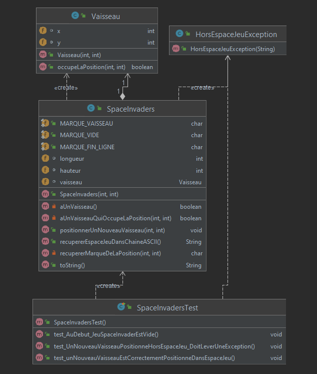
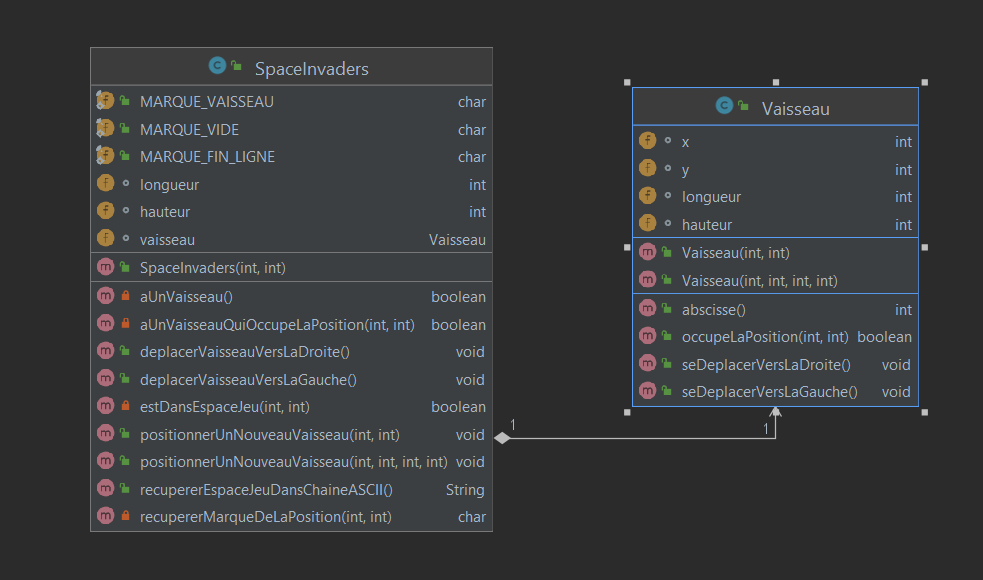
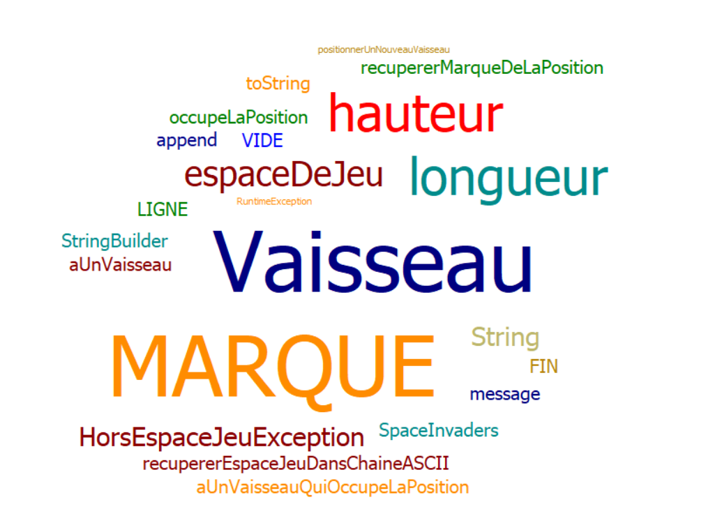
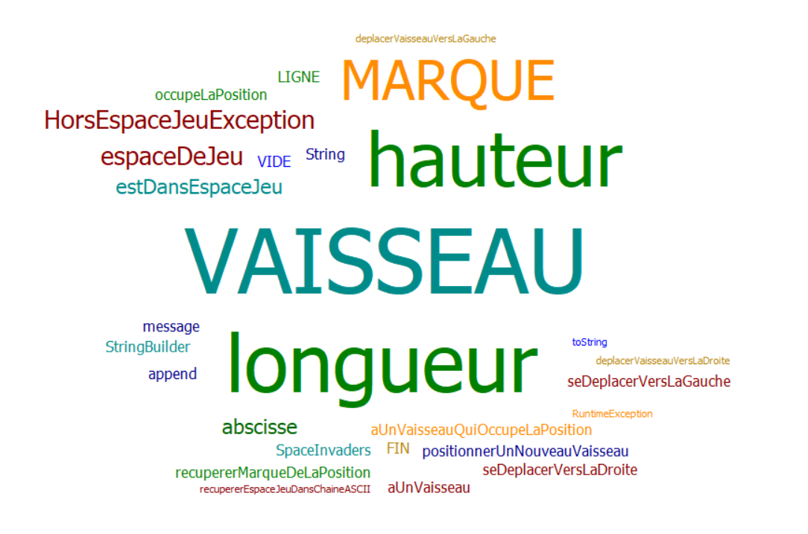

# Space Invaders
Projet Space Invaders M2104

Ce projet consiste à réaliser une copie du jeu Space Invaders grâce au langage java en TDD.

- [Semaine n°1 : du 26 au 30 avril](#semaine1)  
- [Semaine n°2 : du 10 au 15 mai](#semaine2)
- [Glossaire](#glossaire)

## Semaine n°1 : du 26 au 30 avril 

#### Fonctionnalité n°1 : Déplacer un vaisseau dans l'espace de jeu

- Story n°1 : Créer un espace de jeu  

On crée un espace de jeu aux dimensions voulu, celui-ci est vide.

-  Story n°2 : Positionner un nouveau vaisseau dans l’espace de jeu 

On crée un vaisseau qui est positionné au coordonnées donnée.
 Contraintes :
La position que l'on souhaite donnée au vaisseau est modélisé par des coordonnées x et y
La base de notre repère pour les coordonnées est le coin supérieur gauche(le point tout en haut à gauche), il a donc pour coordonnées (0,0)
Pour l'instant, on réduit la taille de notre vaisseau au maximum, c'est à dire un point.

## Semaine n°2 : du 10 au 15 mai 

#### Fonctionnalité n°1 : Déplacer un vaisseau dans l'espace de jeu (fini)

- Story n°3 : Déplacer le vaisseau vers la droite dans l'espace de jeu

Le vaisseau doit se déplacer d'une case vers la droite.
Contraintes :
Si le vaisseau se trouve sur la bordure droite de l'espace de jeu, le vaisseau doit rester immobile (aucun déplacement, aucune exception levée : le vaisseau reste juste à sa position actuelle).

- Story n°4 : Déplacer le vaisseau vers la gauche dans l'espace de jeu

Le vaisseau se déplace d'un pas vers la gauche. 
Contraintes :
Si le vaisseau se trouve sur la bordure gauche de l'espace de jeu, le vaisseau doit rester immobile (aucun déplacement, aucune exception levée : le vaisseau reste juste à sa position actuelle).

### Fonctionnalité en cours d’implémentation : 

#### Fonctionnalité n°2 : Dimensionner le vaiseau

- Story n°1 : Positionner un nouveau vaisseau avec une dimension donnée
On veut pouvoir postionner un vaisseau au coordonnées voulu mais cette fois le vaisseau à des dimensions et n'est plus juste point dans l'espace de jeux

### Diagramme de classes :

#### Semaine 1:

#### Semaine 2:

### Nuage de mots du projet spaceinvaders :  
 
#### Semaine 1 :

#### Semaine 2 :

### Difficultés rencontrées 
Pour l'instant aucune difficulté n'a été rencontré.

### Remarques diverses
Pour que les tests puissent fonctionner, on a été obliger de rajouter une fonction qui vas representer notre espace de jeu sous la forme d'une table ASCII.

-------------

## Glossaire 

* **Vaisseau** :  véhicule commandé par le joueur, pouvant se déplacer de droite à gauche et ayant la possibilité de lancer des missiles destinés à détruire le(s) envahisseurs.

* **Envahisseur**  :  ennemi qui apparaît à l'écran, se déplace automatiquement et qui doit être détruit par un missile lancé depuis le vaisseau du joueur.

* **Missile** :  projectile envoyé à la verticale par le vaisseau vers l'envahisseur dans le but de le détruire.

------------- 
